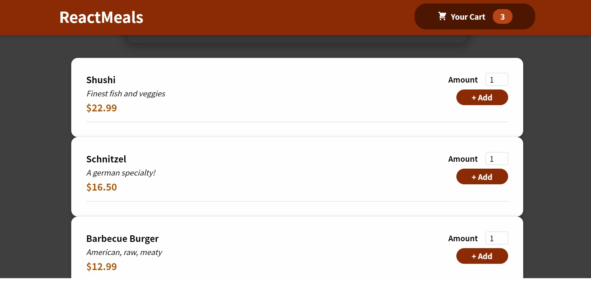
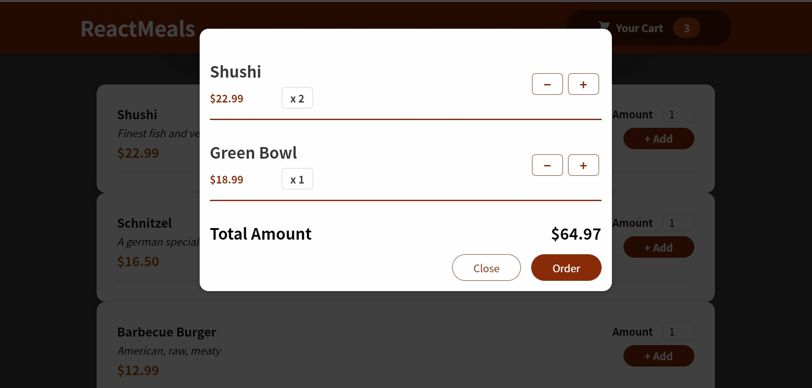

# FoodOrder-App

select meals from the menu, open cart to view or edit the order.

order your meal with the click of the button.

## Screenshots






## Installation

Install FoodOrder-App with npm

```bash
  cd FoodOrder-App
  npm install package.json
```
    
## Environment Variables

To run this project, you will need to add the following environment variables to your .env file

`REACT_APP_ORDER_API`

your database api to recieve order information

`REACT_APP_MEALS_API`

your database api to read meals information
